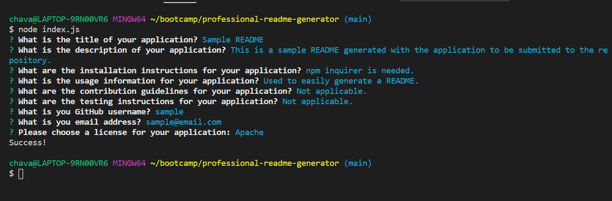
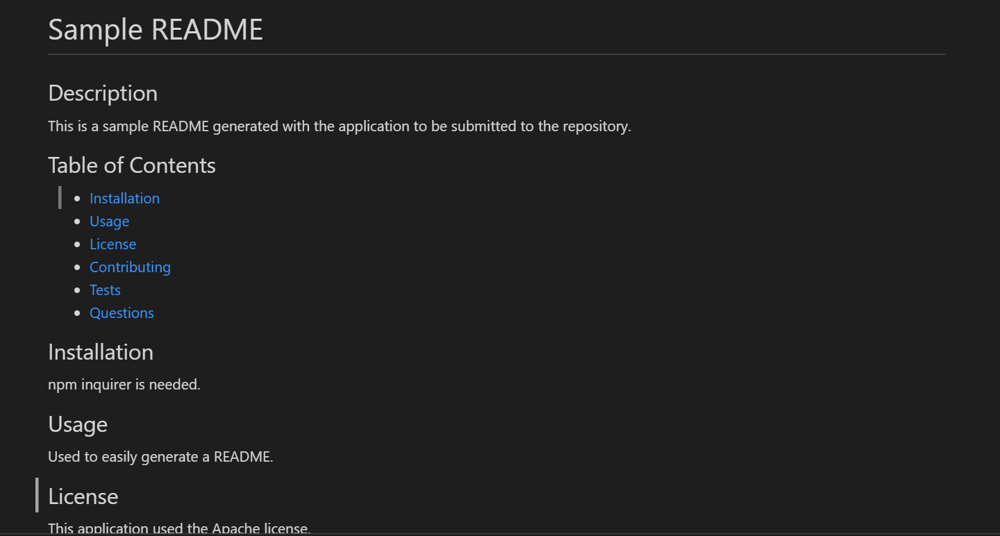

# Professional README Generator

This assignment cosisted of building a command line application that would generate a README based on user input. The application has a couple of JavaScript files that interact with each other to complete the process. After the user runs node index.js, the application starts prompting the user for all the information to be added to the the README. Once the user finishes answering all the questions, the data answered by the user is sent to the generateMarkdown JavaScript file and the actual file is built with all the different things needed to build the file as an actual read me. 

The application uses the inquirer package to promp the user and the fs package to create the file.

Below is a screenshot of the prompts with all questions answered in the terminal:

Below is a screenshot of the sample README generated with the prompts shown above:

## URL

This is the URL for a video showing the application in action:

https://drive.google.com/file/d/1Q18abOQeYPBV_4ZPk2ZLeVLLro0Lakec/view